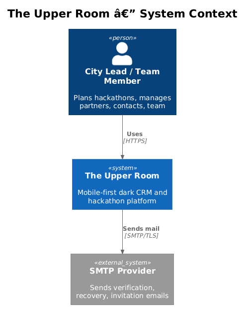
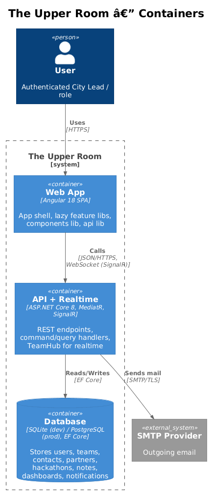
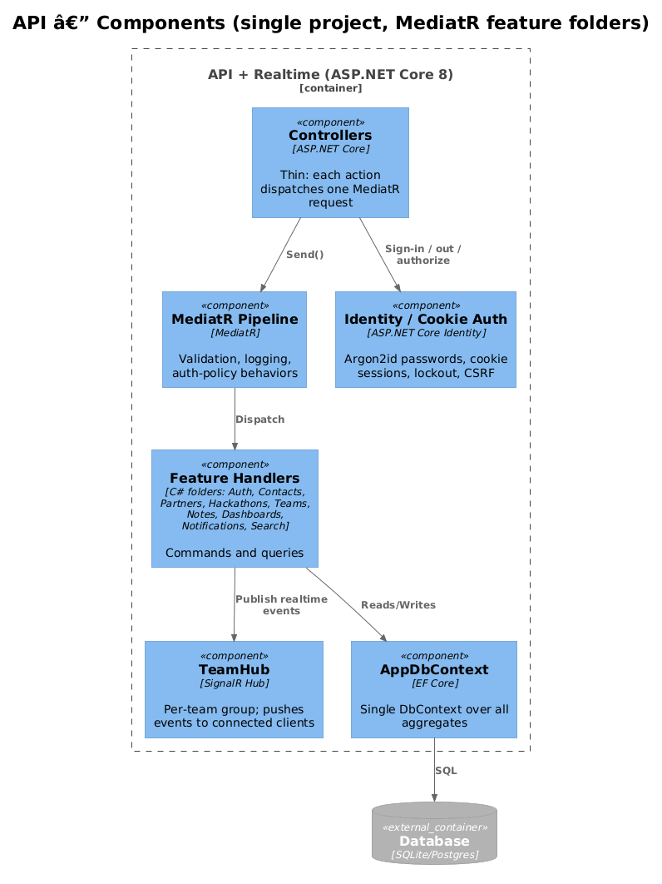
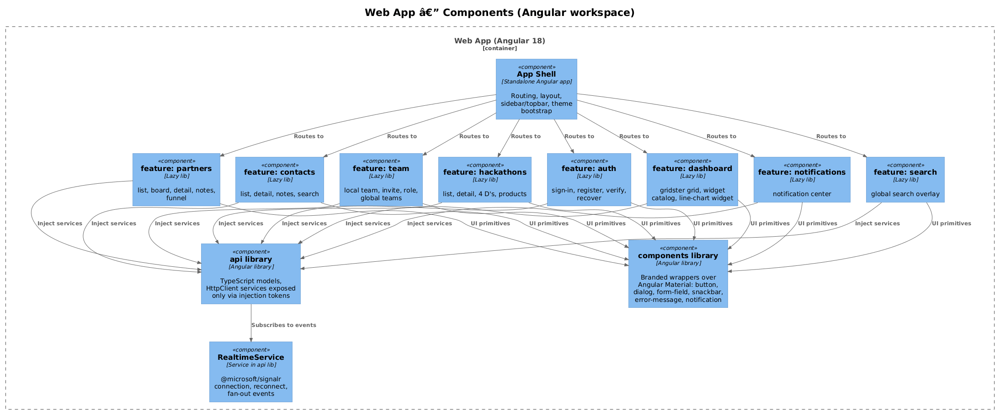
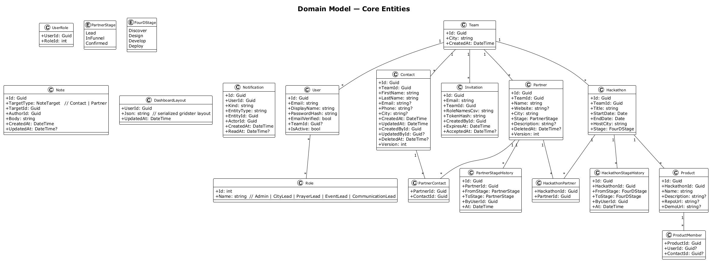

# Architecture Overview — Detailed Design

This document is the shared baseline that every vertical-slice design assumes. Read this first; each slice extends rather than restates it.

## 1. Overview

The Upper Room is a single web application: an Angular 18 SPA backed by a single ASP.NET Core 8 API that also hosts a SignalR hub. Data lives in a single relational database (SQLite for dev/test, PostgreSQL for production) accessed through one EF Core `AppDbContext`.

The architecture is deliberately the smallest thing that satisfies all 18 L1 requirements. There are no microservices, no separate read/write databases, no event bus, no DDD building blocks beyond entities and a few domain enums, no service interfaces with single implementations.

**Actors.** City Leads, Prayer Leads, Event Leads, Communication Leads (per team), and Administrators (cross-team). The internal role constant is `Admin`; user-facing copy uses `Administrator`.

**Scope boundary.** Everything in `frontend/` and `backend/`. Email delivery is the only external dependency.

## 2. Architecture

### 2.1 Context


### 2.2 Containers


### 2.3 API Components


### 2.4 SPA Components


## 3. Backend Layout

One ASP.NET Core project, `TheUpperRoom.Api`. Folders by feature, not by layer:

```
backend/TheUpperRoom.Api/
  Auth/                  // Register, SignIn, SignOut, Verify, Recover, Session
  Contacts/              // Create, Get, Update, Delete, Search, List, Notes
  Partners/              // Create, Get, Update, Delete, ChangeStage, AddContact, Notes
  Hackathons/            // Create, Get, AdvanceStage, Products
  Teams/                 // Local team, Invite, Remove, AssignRole, Global teams
  Dashboards/            // Get/Save layout
  Notifications/         // List, MarkRead, Persist
  Search/                // Global search query
  Realtime/              // TeamHub, broadcast helpers
  Infrastructure/        // AppDbContext, EF migrations, Identity config, MediatR pipeline behaviors, logging
  Program.cs
```

**One handler per command/query.** Each handler is a single class with `Handle(...)`; no abstractions. Controllers are one-liners that dispatch a MediatR request.

**Cross-cutting** lives in MediatR pipeline behaviors:

- `ValidationBehavior` — FluentValidation per request type, returns 400 on failure.
- `LoggingBehavior` — structured Serilog log per request with correlation id.
- `TeamScopeBehavior` — for any request that targets a team-scoped entity, asserts the current user's team matches (skipped for Administrators).

### 3.1 Auth & RBAC
ASP.NET Core Identity with cookies (HttpOnly, Secure, SameSite=Lax). Password hashing uses Argon2id via `Microsoft.AspNetCore.Identity` extension or `Konscious.Security.Cryptography` (configured in `Infrastructure/IdentityConfig.cs`). Roles are seeded at startup. Authorization is by `[Authorize(Roles=...)]` on controllers plus the `TeamScopeBehavior` for data isolation.

### 3.2 Realtime
A single SignalR hub `TeamHub` at `/hubs/team`. On connection, the user joins a group `team:{teamId}`. Handlers that mutate team-scoped state call `_hub.Clients.Group($"team:{teamId}").SendAsync(eventName, payload)` after the database commit.

### 3.3 Persistence
One `AppDbContext`. Migrations in `Infrastructure/Migrations/`. Soft delete is a nullable `DeletedAt` column on the few entities that need it (`Contact`, `Partner`); a global query filter excludes deleted rows. Optimistic concurrency uses an integer `Version` column where the requirement names it (e.g., contact update L2-011).

## 4. Frontend Layout

```
frontend/projects/
  app-shell/             // standalone Angular app, routing, layout
  components/            // already exists; branded Material wrappers
  api/                   // models, injection tokens, concrete services
  feature-auth/
  feature-contacts/
  feature-partners/
  feature-hackathons/
  feature-team/
  feature-dashboard/
  feature-notifications/
  feature-search/
```

Each feature is a lazy-loaded Angular library. Feature libs depend on `components` and `api`; they never depend on each other and never import `@angular/material` directly (L2-060). Feature libs consume the API exclusively through tokens defined in `api` (L2-061).

The dark monochromatic theme is a single SCSS file in `app-shell/styles/theme.scss` plus a Material theme override; it is the only theme.

## 5. Data Model


A single relational schema. No join tables beyond the obvious (`UserRole`, `PartnerContact`, `HackathonPartner`, `ProductMember`). `Note` is one polymorphic table keyed by `TargetType + TargetId` rather than two parallel tables — the only abstraction we adopt because the same edit/delete rules (L2-013, L2-019) apply identically.

## 6. Cross-cutting Concerns

| Concern | Approach |
|---|---|
| Logging (L2-044, L2-045) | Detailed in `36-observability/`: Serilog JSON request/response/exception/audit logs, frontend error forwarding, correlation IDs, sanitization, and acceptance tests. |
| Responsive + theme (L2-039 through L2-042, L2-059) | Detailed in `35-responsive-theme/`: breakpoint rules, hit targets, max width, 12-column dashboard grid, dark monochromatic tokens, Material overrides, and contrast validation. |
| Performance (L2-046, L2-047) | Detailed in `37-performance/`: Lighthouse/Slow 4G budgets, API percentile tests, and search/load data volumes. |
| Security (L2-049 through L2-056) | Detailed in `38-security/`: TLS, password hashing, validation/request limits, injection/XSS/CSRF, rate limits, and secrets scanning. |
| Accessibility (L2-057 through L2-059) | Detailed in `39-accessibility/`: keyboard, focus trap, accessible names, live regions, and contrast checks. |
| Component/API/CQRS/E2E (L2-060 through L2-064) | Detailed in `40-architecture-testing/`: component import enforcement, API token tests, MediatR structure checks, Page Object Model, and multi-viewport matrix. |

## 7. Test Strategy

- **Backend**: xUnit + WebApplicationFactory + SQLite-in-memory. One acceptance test per L2 acceptance criterion, header-commented with the L2 ID.
- **Frontend component**: Angular `TestBed` for each feature lib's smart components.
- **E2E (L2-063, L2-064)**: Playwright with Page Object Model under `frontend/e2e/`, run against the integrated server. The concrete project and viewport matrix is in `40-architecture-testing/`.

## 8. Open Questions

1. Database choice for production — SQLite or PostgreSQL? SQLite keeps the architecture truly minimal but caps concurrency. Default is SQLite until volume forces a move; the same EF Core code works for both.
2. Email provider — SendGrid vs AWS SES vs SMTP relay. Doesn't affect the design; pick whichever the org already pays for.
3. Hosting — single container with backend + static SPA assets, or split CDN + API? Single container is simpler; the design assumes that and can be split later if needed.
4. Should `feature-search`, `feature-notifications` be standalone routes or shell-owned overlays? Treating them as feature libs keeps the shell thin; the shell only references them by lazy route.
