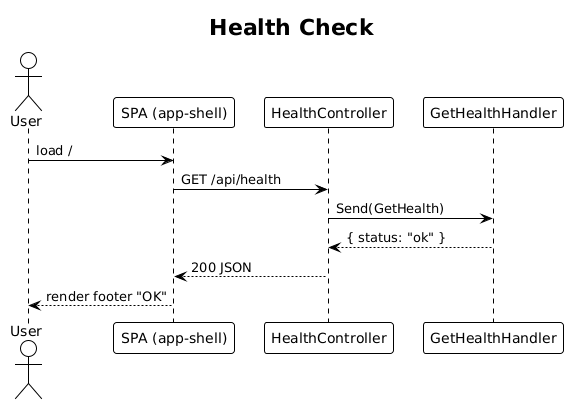

# 01 — Project Skeleton & Health Check

**Vertical slice:** boot the entire stack end-to-end with the smallest possible feature: a `GET /api/health` that the SPA pings on load and renders "OK" on the sign-in screen footer. This proves the plumbing — Angular workspace, MediatR controller, database connection, CI build — before any business slice lands.

**Traces to:** none directly; precondition for every other slice. Touches L1-009 (responsive), L1-016 (components lib), L1-017 (api lib), L1-018 (E2E).

## Components introduced

- Backend: `TheUpperRoom.Api` project under `backend/TheUpperRoom.Api/`, `Program.cs`, `AppDbContext` configuration only. No health-check table is needed.
- Backend: `Health/GetHealth.cs` — MediatR query returning `{ status: "ok", version, time }`.
- Backend: `HealthController : ControllerBase` with one action.
- Frontend: `app-shell` standalone Angular app under `frontend/projects/app-shell/`, with a single root component that renders an empty page plus a footer.
- Frontend: `api` library under `frontend/projects/api/` exporting `HEALTH_SERVICE` injection token and `HealthService` concrete impl.
- Frontend: `components` library already exists; this slice adds nothing to it.

## Workflow


## Data Model
None.

## API
| Method | Path | Auth | Response |
|---|---|---|---|
| GET | `/api/health` | anonymous | `200 { status, version, time }` |

## Acceptance test (Playwright)
```ts
// Acceptance Test
// Traces to: 01 - skeleton
// Description: SPA boots and reads /api/health
test('shows healthy status', async ({ page }) => {
  await page.goto('/');
  await expect(page.getByTestId('health-status')).toHaveText('OK');
});
```

## Radical simplicity notes
- No DbContext-per-feature; one `AppDbContext` for the whole platform.
- No service interface in `api` lib for `HealthService` — the injection token *is* the seam.
- No abstraction layer in the controller — direct `mediator.Send`.

## Status
Complete

## Decision
- The health check does not require a real DB row. `GetHealth` returns a constant and verifies app boot. EF Core configuration is wired here, but migrations start in slice 02.
