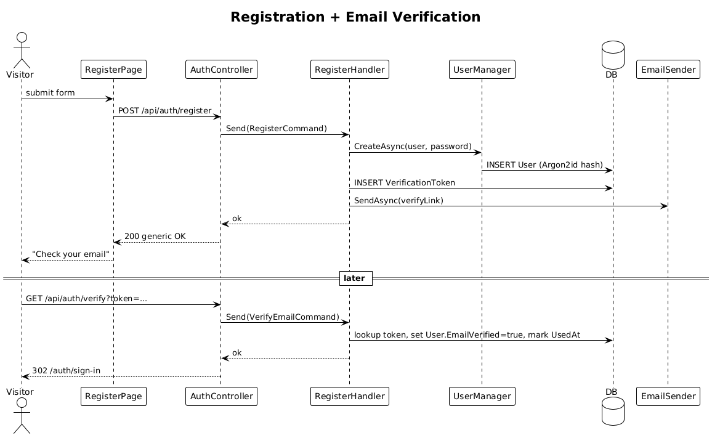

# 02 — User Registration

**Traces to:** L2-001 (L1-001).

A visitor submits email, password, display name, and city. We create a pending `User` and send a verification email. Clicking the link activates the account and redirects to sign-in.

## Components

- Backend `Auth/Register.cs` — `RegisterCommand { Email, Password, DisplayName, City }` + handler. Uses `UserManager<User>` (Identity) with Argon2id password hashing per L2-050. Generates a `VerificationToken` row tied to the user with 24-hour expiry (L2-001 AC2).
- Backend `Auth/VerifyEmail.cs` — `VerifyEmailCommand { Token }` + handler.
- Backend `EmailSender` — single class wrapping `System.Net.Mail.SmtpClient` (or vendor SDK). One method `SendAsync(to, subject, body)`. No interface.
- Backend `AuthController` — `POST /api/auth/register`, `GET /api/auth/verify?token=…`.
- Frontend `feature-auth/register-page` standalone component, reactive form, calls `AUTH_SERVICE.register(...)`.
- Frontend `feature-auth/verify-page` reads `?token=` query param, calls `AUTH_SERVICE.verify(token)`, redirects to `/auth/sign-in`.
- Frontend `api` lib adds `AUTH_SERVICE` token + `AuthService.register/verify` methods.

## Workflow


## Data Model

Add to `00-architecture` model:

```
VerificationToken
  Id: Guid
  UserId: Guid
  Token: string (cryptographically random, hashed at rest)
  ExpiresAt: DateTime
  UsedAt: DateTime?
```

User gains `EmailVerified: bool` (default false) and `City: string`.

## API

| Method | Path | Body | Response |
|---|---|---|---|
| POST | `/api/auth/register` | `{ email, password, displayName, city }` | `200` (always — generic message per L2-001 AC3) |
| GET | `/api/auth/verify?token=...` | – | `302` to sign-in or `400` with "expired or used" |

## Validation (FluentValidation)

- `Email`: required, email format.
- `Password`: ≥12 chars, contains lower/upper/digit/symbol.
- `DisplayName`: 1–100 chars.
- `City`: 1–100 chars.

## Radical simplicity notes
- One `User` row from creation; `EmailVerified=false` instead of a separate "PendingUser" entity.
- No background queue; the handler sends email synchronously. If SMTP is slow, the request hits its 30 s ceiling — acceptable until volume forces a queue.
- `EmailSender` is a concrete class. No `IEmailSender` interface (no second implementation needed yet).
- Generic 200 response on duplicate email avoids account enumeration without any extra abstraction (L2-001 AC3).

## Acceptance test (Playwright)
```ts
// Acceptance Test
// Traces to: L2-001
test('register, verify, sign in', async ({ page, mailbox }) => {
  await registerPage.submit({ email, password, displayName, city });
  const link = await mailbox.waitForVerificationLink(email);
  await page.goto(link);
  await expect(page).toHaveURL(/\/auth\/sign-in/);
});
```

## Open Questions
- How is mail captured during E2E? Default: a `MailHog`-style capture container in dev/CI; the `mailbox` fixture polls its API.
