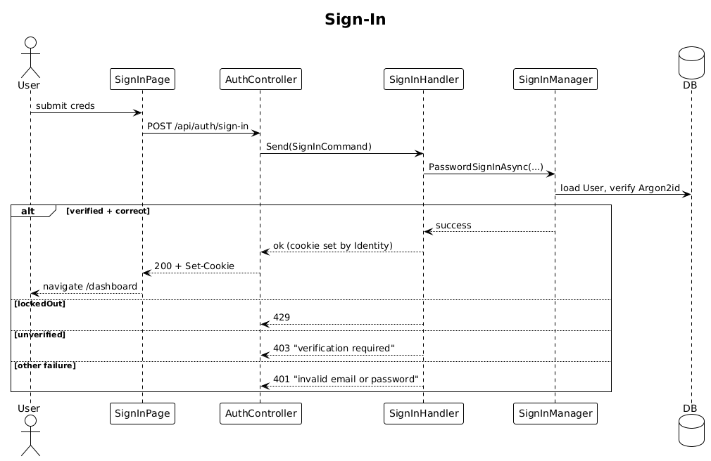

# 03 — User Sign-In

**Traces to:** L2-002 (L1-001), with lockout per L2-055.

## Status
Accepted

Authenticate by email + password, issue an Identity cookie session, redirect to `/dashboard`.

## Components

- Backend `Auth/SignIn.cs` — `SignInCommand { Email, Password }` + handler. Uses `SignInManager<User>.PasswordSignInAsync(..., lockoutOnFailure: true)`. Lockout window = 15 min after 5 failures (L2-002 AC4).
- Backend `AuthController.SignIn` — `POST /api/auth/sign-in`.
- Backend rate limiter — fixed-window 10/min per IP on `/api/auth/sign-in` (L2-055).
- Frontend `feature-auth/sign-in-page` reactive form; on success navigates `/dashboard`.

## Workflow


## API

| Method | Path | Body | Response |
|---|---|---|---|
| POST | `/api/auth/sign-in` | `{ email, password }` | `200` + Set-Cookie / `401` "invalid email or password" / `403` "verification required" / `429` |

## Cookie

Set by Identity middleware: `HttpOnly; Secure; SameSite=Lax; Path=/`. Sliding 30 min, absolute 12 h (configured in `IdentityConfig.cs`, see slice 05).

## Radical simplicity notes
- No JWT, no refresh tokens, no custom token store — Identity cookies only.
- The same generic 401 message regardless of which field failed (L2-002 AC3) is achieved by Identity defaults; no custom logic.
- Lockout is built into Identity; we just configure thresholds.

## Acceptance test
```ts
// Acceptance Test
// Traces to: L2-002
test('signs in and redirects to dashboard', async ({ page }) => {
  await signInPage.submit({ email, password });
  await expect(page).toHaveURL(/\/dashboard/);
});
```

Additional acceptance coverage:
- Unverified accounts receive the "verification required" message and no session.
- Invalid credentials always receive the generic "invalid email or password" message.
- Five failed attempts within 15 minutes lock the account for 15 minutes; the sixth attempt is rejected and an audit/throttle event is logged.
- More than 10 sign-in requests from one IP within 1 minute returns 429.

## Open Questions
None.
