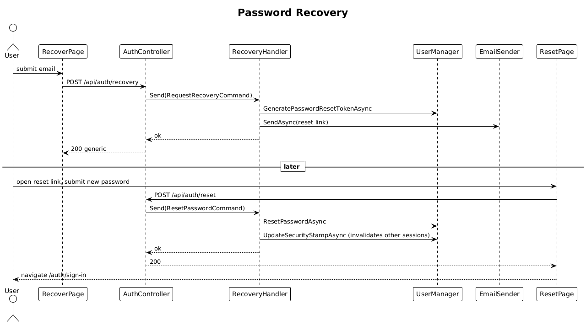

# 04 — Password Recovery

**Traces to:** L2-003 (L1-001).

## Status
Accepted

Email-based reset using Identity's `GeneratePasswordResetTokenAsync` + `ResetPasswordAsync`.

## Components

- Backend `Auth/RequestRecovery.cs` — `RequestRecoveryCommand { Email }`. Looks up user; if found, generates token, sends email with link `/{spa}/auth/reset?token=…&email=…`. Always returns 200 with generic message (L2-003 AC1).
- Backend `Auth/ResetPassword.cs` — `ResetPasswordCommand { Email, Token, NewPassword }`. Calls `UserManager.ResetPasswordAsync`; on success, calls `UserManager.UpdateSecurityStampAsync(user)` so all existing cookies are invalidated (L2-003 AC2).
- Backend rate limit — 3 requests / 15 min per email on the request endpoint (L2-055 AC2).
- Frontend `feature-auth/recover-page`, `feature-auth/reset-page`.

## Workflow


## API

| Method | Path | Body | Response |
|---|---|---|---|
| POST | `/api/auth/recovery` | `{ email }` | `200` generic |
| POST | `/api/auth/reset`    | `{ email, token, newPassword }` | `200` / `400` "expired or already used" |

## Radical simplicity notes
- Identity handles token generation, expiry (1 h via configured `DataProtectionTokenProviderOptions.TokenLifespan`), and single-use semantics.
- Security-stamp bump invalidates other sessions for free — no manual session table cleanup.

## Acceptance test
```ts
// Acceptance Test
// Traces to: L2-003
test('reset password and sign in', async ({ page, mailbox }) => {
  await recoverPage.submit(email);
  const link = await mailbox.waitForResetLink(email);
  await page.goto(link);
  await resetPage.submit(newPassword);
  await signInPage.submit({ email, password: newPassword });
  await expect(page).toHaveURL(/\/dashboard/);
});
```

Additional acceptance coverage:
- Requesting recovery for a registered or unregistered email displays the same generic message.
- The recovery email is sent within 30 seconds when the account exists and rate limits allow it.
- Used or older-than-60-minute recovery links return "expired or already used".
- More than 3 recovery requests for the same email in 15 minutes returns the generic message but sends no additional email.
