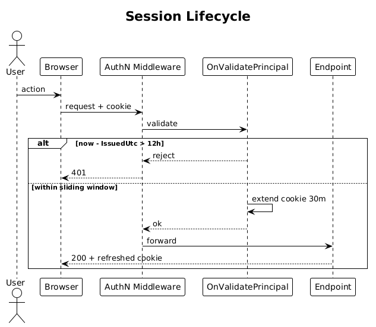

# 05 — Session Management

**Traces to:** L2-004 (L1-001).

## Status
Accepted

Configure Identity cookie options. No code beyond `Program.cs` configuration and one acceptance test.

## Configuration (`Program.cs`)

```csharp
services.ConfigureApplicationCookie(o => {
    o.Cookie.HttpOnly = true;
    o.Cookie.SecurePolicy = CookieSecurePolicy.Always;
    o.Cookie.SameSite = SameSiteMode.Lax;
    o.ExpireTimeSpan = TimeSpan.FromMinutes(30);  // sliding window
    o.SlidingExpiration = true;
    o.LoginPath = "/auth/sign-in";
});
```

Absolute 12 h cap (L2-004 AC3) is enforced by a tiny custom `CookieAuthenticationEvents.OnValidatePrincipal`:

```csharp
// reject if (now - issuedUtc) > 12h
```

## Workflow


## Acceptance tests
- Cookie has `HttpOnly; Secure; SameSite=Lax` after sign-in (L2-004 AC1).
- After 25 min of activity the cookie still works (sliding extension; L2-004 AC2).
- After 12 h since sign-in, the next request returns 401 even if the cookie is otherwise valid (L2-004 AC3) — driven by faking `IssuedUtc` in a test handler.

## Radical simplicity notes
- No server-side session store; cookies are self-contained ticket-encrypted.
- No custom middleware — one event hook for the absolute cap.

## Open Questions
None.
