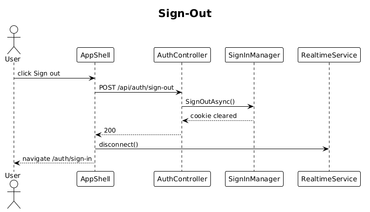

# 06 — User Sign-Out

**Traces to:** L2-005 (L1-001).

## Components

- Backend `AuthController.SignOut` → `POST /api/auth/sign-out`. Calls `SignInManager.SignOutAsync()` and emits an audit log.
- Frontend `app-shell` sign-out button (in topbar / sidebar profile per `ui-design.pen` `sbProfile`). Calls `AUTH_SERVICE.signOut()`, then `RealtimeService.disconnect()`, then `router.navigateByUrl('/auth/sign-in')`.

## Workflow

## Acceptance tests (L2-005)
- After sign-out, replaying the prior cookie returns 401.
- After sign-out, the SignalR hub is disconnected.

## Radical simplicity notes
- Identity handles cookie clearing; no custom session table to evict.
- The audit log is one Serilog call — no separate audit table.
