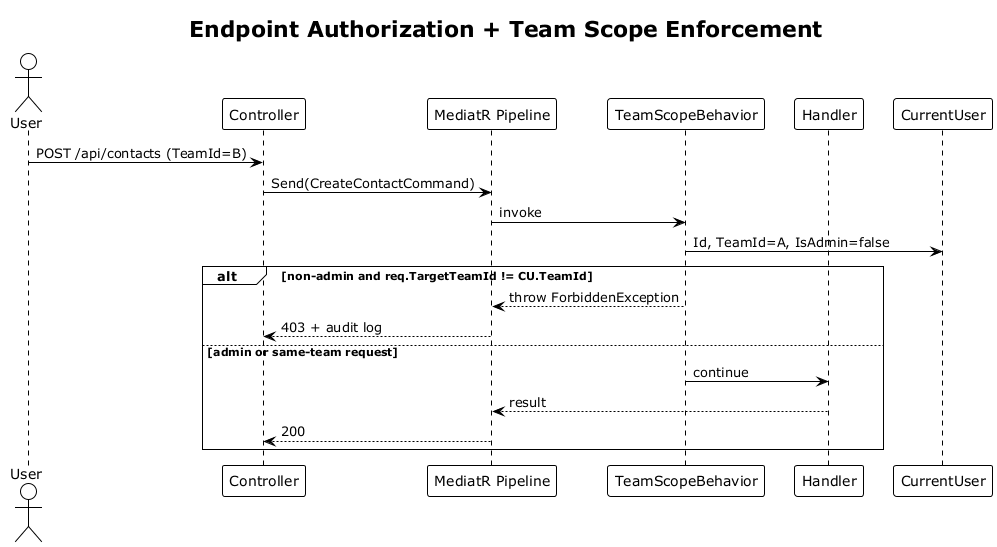

# 07 — RBAC: Roles, Endpoint Authorization, Team Isolation

**Traces to:** L2-006, L2-007, L2-008 (L1-002).

This slice introduces the role catalog and the two enforcement points used by every later slice: per-endpoint `[Authorize(Roles=...)]` and a MediatR `TeamScopeBehavior` that rejects cross-team access for non-Administrators.

## Components

- Backend `Infrastructure/Roles.cs` — string constants `Admin, CityLead, PrayerLead, EventLead, CommunicationLead`.
- Backend `Infrastructure/SeedRoles.cs` — startup hosted service inserting the five roles if absent.
- Backend `Auth/AssignRole.cs` — `AssignRoleCommand { TargetUserId, Role, Add|Remove }`. Permits Admin always; CityLead only on members of own team and only for the three lower roles.
- Backend `Infrastructure/TeamScopeBehavior.cs` — MediatR `IPipelineBehavior<TReq,TRes>`. Any request that implements `ITeamScopedRequest { Guid TargetTeamId }` is rejected with `403` if `currentUser.TeamId != TargetTeamId` and the user is not Admin.
- Backend `Infrastructure/CurrentUser.cs` — scoped service reading `HttpContext.User`; properties `Id, TeamId, IsAdmin, Roles`.
- Frontend `app-shell/route-guards/role.guard.ts` — Angular `CanActivate` reading `data.roles` on a route, redirecting to `/no-access` on mismatch.
- Frontend `feature-auth/no-access-page` — minimal screen shown when guard denies.

## Workflow

## API

| Method | Path | Auth | Notes |
|---|---|---|---|
| POST | `/api/users/{id}/roles` | Admin or CityLead (constrained) | `{ role, action: "add" \| "remove" }` |

## Acceptance tests
- L2-006 AC1: Admin can assign all five roles; effect on next request without sign-out.
- L2-006 AC2: CityLead can assign three lower roles; cannot assign Admin/CityLead → 403.
- L2-006 AC3: Prayer/Event/Communication Leads attempting any role assignment receive 403.
- L2-007 AC1: anonymous request to a non-public endpoint → 401.
- L2-007 AC2: authenticated user without role → 403 + audit log.
- L2-007 AC3: Angular route without role → redirected to `/no-access`; the protected feature module is not loaded.
- L2-008 AC1: cross-team mutation by non-Admin → 403 (TeamScopeBehavior).
- L2-008 AC2: Administrator performs the same cross-team operation successfully.
- L2-008 AC3: non-Administrator global team listing returns only public summary fields (`city`, role counts, active hackathon count, partner count) and does not include contacts, partner notes, or contact notes. The spec reference to L2-033 is treated as a typo; this is implemented by slice 29 (`L2-030`).

## Radical simplicity notes
- One pipeline behavior covers L2-008 across every command/query that opts in by implementing the marker interface — no per-handler boilerplate.
- Roles are strings, not enums, so `[Authorize(Roles="Admin,CityLead")]` works directly.
- "Effect on next request without sign-out" (L2-006 AC1, L2-029 AC3) is automatic — Identity reloads roles on each request via security stamp validation.

## Open Questions
None. Pipeline order is fixed as Logging → Validation → TeamScope → Handler. Validation first so malformed requests get 400 before authorization/team-scope checks.
