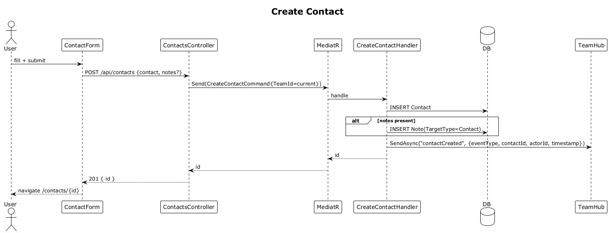

# 08 — Create Contact

**Traces to:** L2-009 (L1-003).

## Status
Accepted

## Components
- Backend `Contacts/CreateContact.cs` — `CreateContactCommand : ITeamScopedRequest { TargetTeamId, FirstName, LastName, Email?, Phone?, City?, Notes? }` + handler that inserts a `Contact` row and, when `Notes` is non-empty, inserts the first `Note` for that contact in the same transaction. Returns `{ id }`.
- Backend `ContactsController.Create` — `POST /api/contacts`, `[Authorize(Roles="Admin,CityLead,PrayerLead,EventLead,CommunicationLead")]`.
- Backend `Contacts/CreateContactValidator.cs` — FluentValidation rules.
- Frontend `feature-contacts/contact-form` (used for create + update) reactive form. Create mode includes an optional initial notes textarea. Submits via `CONTACT_SERVICE.create(...)`.
- Frontend `feature-contacts/contact-create-page` route `/contacts/new`.

## Workflow


## API
| Method | Path | Body | Response |
|---|---|---|---|
| POST | `/api/contacts` | `{ firstName, lastName, email?, phone?, city?, notes? }` | `201 { id }` / `400` |

## Validation
- `FirstName`, `LastName`: required, ≤100 chars.
- `Email`: optional; if present, valid email.
- `Phone`: optional; if present, E.164 or local format (regex).
- `City`: optional, ≤100 chars.
- `Notes`: optional; if present, 1–4000 chars. Empty/whitespace notes are ignored.

## Acceptance test
```ts
// Acceptance Test
// Traces to: L2-009
test('city lead creates a contact', async ({ page }) => {
  await page.goto('/contacts/new');
  await contactForm.fill({ firstName: 'Ava', lastName: 'Lee', notes: 'Met at partner kickoff.' });
  await contactForm.submit();
  await expect(page).toHaveURL(/\/contacts\/[a-f0-9-]+/);
});
```

Additional acceptance coverage:
- Malformed email and invalid phone show field-level errors and the backend returns 400.
- Missing first or last name is blocked client-side and rejected server-side.
- Optional notes are saved as the newest note on the created contact.
- A 4001-character initial note is rejected with a field-level message.

## Radical simplicity notes
- `TargetTeamId` is set automatically by the controller from `CurrentUser.TeamId`. The user does not pass it.
- One handler; no service class between controller and handler.
- The optional first note uses the same `Note` table and authoring rules as slice 12; it is inserted inline only to satisfy create-contact ACs without a second round trip.
