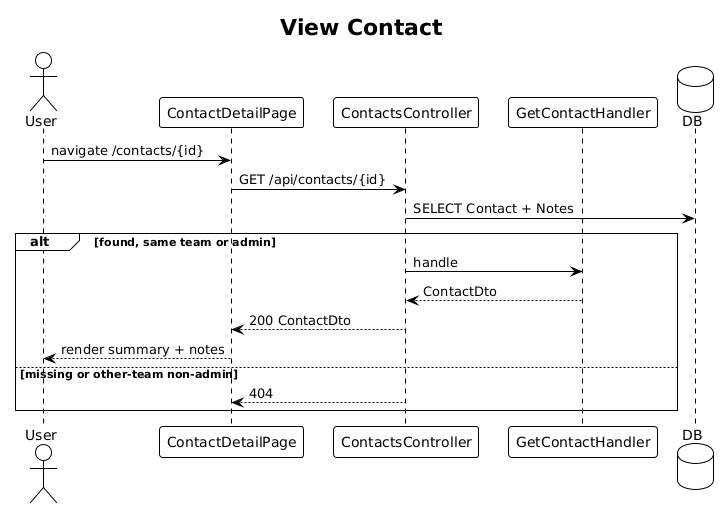

# 09 — View Contact

**Traces to:** L2-010 (L1-003).

Single-screen contact detail with notes section (notes feature lands in slice 12; here we only render an empty notes panel).

## Components
- Backend `Contacts/GetContact.cs` — `GetContactQuery : ITeamScopedRequest { TargetTeamId, Id }`. Returns `ContactDto` with first/last name, email, phone, city, createdAt, updatedAt, createdByDisplayName, plus `Notes: NoteDto[]` ordered desc.
- Backend `ContactsController.Get` — `GET /api/contacts/{id}`. Resolves the contact's `TeamId` from DB, sets `TargetTeamId`, dispatches; if non-Admin and team mismatch → 404 (per L2-008/L2-010 AC2).
- Frontend `feature-contacts/contact-detail-page` route `/contacts/:id`. Layout matches `ui-design.pen` mobile detail screen (`mpdHero` + sections).

## Workflow

## API
| Method | Path | Response |
|---|---|---|
| GET | `/api/contacts/{id}` | `200 ContactDto` / `404` |

## Responsive notes (per L2-010 AC3)
- `<576px`: single-column stack, notes below summary.
- `≥768px`: two-column split, notes on right.

## Radical simplicity notes
- The handler does one EF Core query with `.Include(c => c.Notes)` rather than two round-trips.
- Returning 404 instead of 403 for cross-team access is one `if` in the controller — no special exception class.
