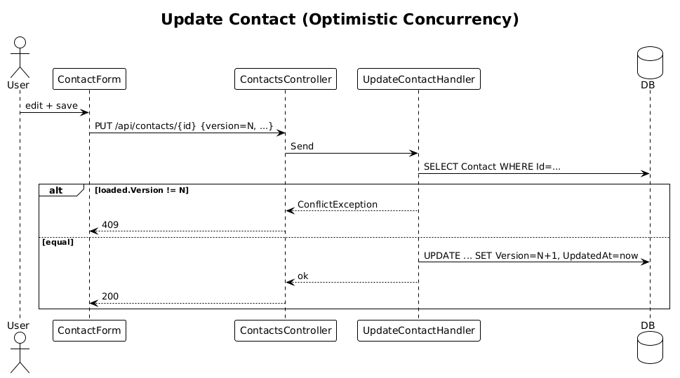

# 10 — Update Contact

**Traces to:** L2-011 (L1-003). Adds optimistic concurrency.

## Components
- Backend `Contacts/UpdateContact.cs` — `UpdateContactCommand : ITeamScopedRequest { Id, TargetTeamId, FirstName, LastName, Email?, Phone?, City?, Version }`. Handler loads contact, asserts `Contact.Version == cmd.Version`; if mismatch, throws `ConflictException` → 409. Otherwise updates fields, increments `Version`, sets `UpdatedAt`, sets `UpdatedById`.
- Backend `ContactsController.Update` — `PUT /api/contacts/{id}`.
- Backend `Infrastructure/ConflictExceptionFilter.cs` — translates `ConflictException` to 409 (or use `ProblemDetails`).
- Frontend `contact-form` reused. Form holds `version` from the GET response and round-trips it on PUT.

## Workflow

## API
| Method | Path | Body | Response |
|---|---|---|---|
| PUT | `/api/contacts/{id}` | full ContactDto + version | `200` / `409` |

## Acceptance tests (L2-011)
- Edit succeeds, `UpdatedAt`/`UpdatedById` advance.
- Stale version → 409 with clear error.

## Radical simplicity notes
- Concurrency uses an integer `Version` column rather than EF Core's `[Timestamp] byte[]`, because integers serialize cleanly to JSON. No ETag header pipeline.
