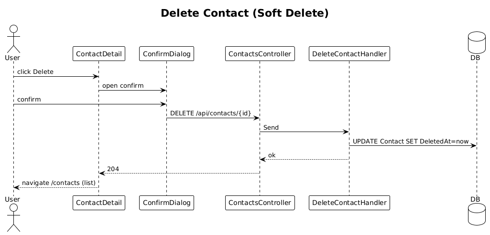

# 11 — Delete Contact

**Traces to:** L2-012 (L1-003). Soft delete with confirmation.

## Status
Complete

## Components
- Backend `Contacts/DeleteContact.cs` — `DeleteContactCommand : ITeamScopedRequest { Id, TargetTeamId }`. Handler sets `Contact.DeletedAt = now`. `[Authorize(Roles="Admin,CityLead")]` on the controller.
- Backend `ContactsController.Delete` — `DELETE /api/contacts/{id}`.
- Backend `AppDbContext` global query filter: `entity.HasQueryFilter(c => c.DeletedAt == null)` so default reads exclude soft-deleted rows.
- Backend `Admin/RestoreContact.cs` (Admin-only) — `POST /api/admin/contacts/{id}/restore` for L2-012 AC3. Uses `IgnoreQueryFilters()` to find deleted rows.
- Frontend `feature-admin/deleted-contacts-page` — Administrator-only audit/restore view showing soft-deleted contacts with deleted-at timestamp, original team/city, and a Restore action.
- Frontend `confirm-delete` dialog reused from `components` lib (pattern matches `ui-design.pen` `confirmDel`). Triggered from contact detail's overflow menu.

## Workflow

## Acceptance tests (L2-012)
- City Lead delete → contact disappears from default lists and search.
- Prayer/Event/Communication Lead delete → 403.
- Admin views audit/restore screen → soft-deleted contact appears and is restorable.

## Radical simplicity notes
- One nullable timestamp + one query filter implements soft delete across every read.
- Admin restore is one extra command, gated by role; no separate "deleted contacts" service.
