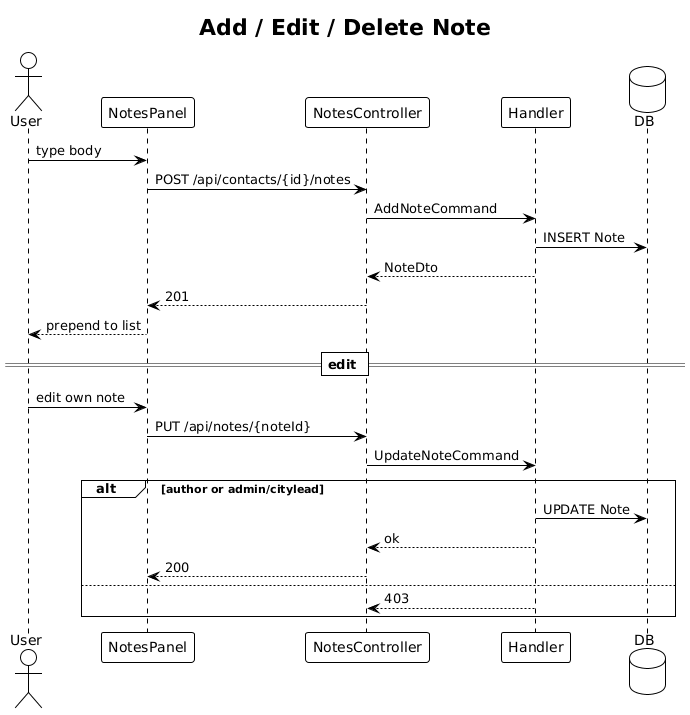

# 12 — Contact Notes

**Traces to:** L2-013 (L1-003). Same `Note` entity will be reused for partners (slice 18).

## Components
- Backend `Notes/AddNote.cs` — `AddNoteCommand { TargetType: "Contact", TargetId, Body }`. Handler inserts a `Note`, returns `NoteDto`.
- Backend `Notes/UpdateNote.cs` / `DeleteNote.cs` — author-only or Admin/CityLead override.
- Backend `NotesController` — `POST /api/contacts/{id}/notes`, `PUT /api/notes/{noteId}`, `DELETE /api/notes/{noteId}`. (Partners reuse via `POST /api/partners/{id}/notes`.)
- Frontend `feature-contacts/notes-panel` component (smart): list ordered desc, inline `add-note` form, edit-in-place, delete confirm. Shown on contact-detail page.

## Workflow

## Data Model
`Note` already defined in 00-architecture: `TargetType + TargetId` polymorphic key.

## API
| Method | Path | Body | Response |
|---|---|---|---|
| POST   | `/api/contacts/{id}/notes` | `{ body }` | `201 NoteDto` |
| PUT    | `/api/notes/{noteId}` | `{ body }` | `200` / `403` |
| DELETE | `/api/notes/{noteId}` | – | `204` / `403` |

## Validation
- Body length 1–4000.

## Acceptance tests (L2-013)
- Author can add, edit, delete own notes.
- Non-author non-Admin/CityLead → 403.
- Admin or CityLead can edit/delete any note in their team.
- 4001-char body → 400.

## Radical simplicity notes
- One `Note` table for both contact and partner notes — same edit/delete rules apply (L2-013 ≡ L2-019).
- "Author or override" is a single conditional; no policy abstraction.
