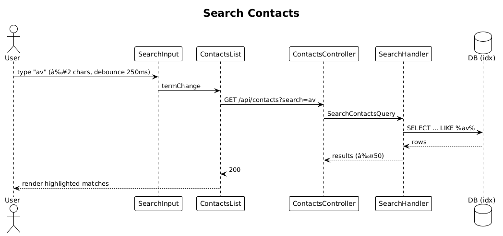

# 13 — Search Contacts ✅ Complete

**Traces to:** L2-014 (L1-003, L1-011).

## Components
- Backend `Contacts/SearchContacts.cs` — `SearchContactsQuery : ITeamScopedRequest { TargetTeamId, Term }`. Handler runs one EF Core query with case-insensitive `LIKE` over `FirstName`, `LastName`, `Email`, `Phone`, and `Notes.Body`. Returns max 50 matches with snippets.
- Backend `ContactsController.Search` — `GET /api/contacts?search=...`. (Combined with list endpoint; list returns 25/page when no search term — see slice 14.)
- Frontend `feature-contacts/contacts-list-page` adds a search input that debounces 250 ms and only fires when the term length ≥ 2.
- Frontend `components/highlight` pipe to wrap matches in `<mark>`.

## Workflow

## API
| Method | Path | Response |
|---|---|---|
| GET | `/api/contacts?search=ava` | `200 [{ id, firstName, lastName, city, snippet, matchedField }]` |

## Performance (L2-014 AC1)
- Indexes on `Contact(FirstName)`, `Contact(LastName)`, `Contact(Email)`, `Note(Body)` (Postgres GIN; SQLite FTS5 in dev — same EF query works against both).

## Acceptance tests
- 2-char term returns matches across all five fields, ≤500 ms over 10 k contacts.
- 1-char term: no request fires (asserted on the network log).
- Each result displays first name, last name, city, and a matched-field snippet with the term highlighted.

## Radical simplicity notes
- Snippet generation is in-handler `string.Concat(left, body[hit..hit+term.Length], right)`. No Lucene, no separate search service.
- Postgres GIN index uses `pg_trgm`; SQLite uses FTS5 contentless table mirrored from `Note.Body` via triggers in a migration. Either way, the application-level code is identical.
