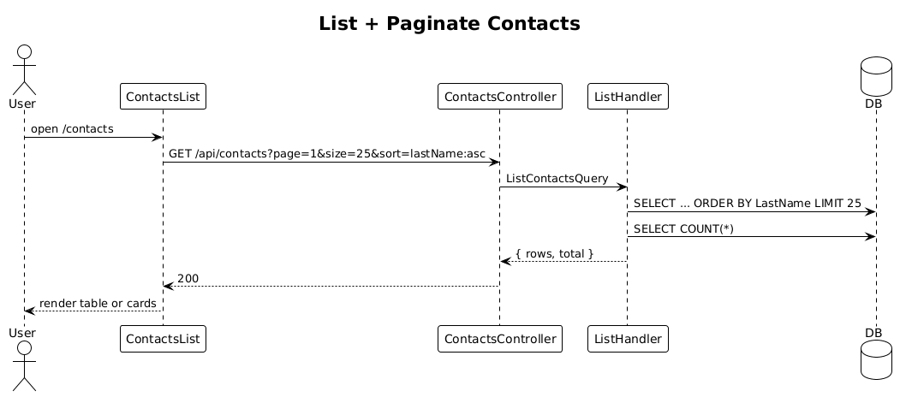

# 14 — List & Paginate Contacts

**Traces to:** L2-015 (L1-003).

## Components
- Backend `Contacts/ListContacts.cs` — `ListContactsQuery : ITeamScopedRequest { TargetTeamId, Page=1, Size=25, Sort="lastName:asc" }`. Returns `{ rows, total }`.
- Backend `ContactsController.List` is the same `GET /api/contacts` endpoint as search (when no `search=` provided, it runs `ListContactsQuery`).
- Frontend `feature-contacts/contacts-list-page` — table on ≥576 px, vertical card list on <576 px (per `ui-design.pen` `Mobile / Partners` pattern, applied to contacts).

## Workflow

## API
| Method | Path | Response |
|---|---|---|
| GET | `/api/contacts?page=1&size=25&sort=lastName:asc` | `200 { rows, total }` |

## Responsive
- `<576px` collapses sort/filter into a kebab menu (matches `ui-design.pen` mobile pattern).

## Acceptance tests (L2-015)
- 25/page, default sort lastName asc.
- Click sortable header toggles asc/desc.
- <576 px renders cards, controls in menu.

## Radical simplicity notes
- One endpoint serves both list and search by branching on the `search` query param presence in the controller; no two routes.
