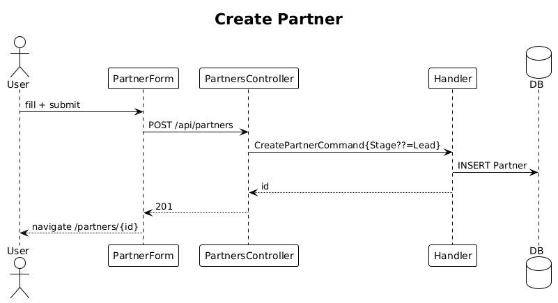

# 15 — Create Partner ✅ Complete

**Traces to:** L2-016 (L1-004).

## Components
- Backend `Partners/CreatePartner.cs` — `CreatePartnerCommand : ITeamScopedRequest { TargetTeamId, Name, Website?, City, Stage?, Description? }`. Defaults `Stage` to `Lead` if absent. Returns `{ id }`.
- Backend `PartnersController.Create` — `POST /api/partners`.
- Frontend `feature-partners/partner-form` reactive form. Submits via `PARTNER_SERVICE.create(...)`.
- Frontend matches `ui-design.pen` `addPartner` modal pattern.

## Workflow

## API
| Method | Path | Body | Response |
|---|---|---|---|
| POST | `/api/partners` | `{ name, website?, city, stage?, description? }` | `201 { id }` / `400` |

## Validation
- `Name`: required, ≤200 chars.
- `Website`: optional; `Uri.TryCreate(.., UriKind.Absolute, ..)` and scheme http/https.
- `City`: required, ≤100 chars.
- `Stage`: enum.

## Acceptance tests (L2-016)
- New partner persists within 1 second, defaults stage to Lead, and is attributed to the actor's local team.
- Malformed website rejected with field-level error.

## Radical simplicity notes
- Partner stage is an enum column, not a separate table.
- Modal-based create matches the design's `addPartner` and is implemented with the existing `dialog` from `components` lib.
