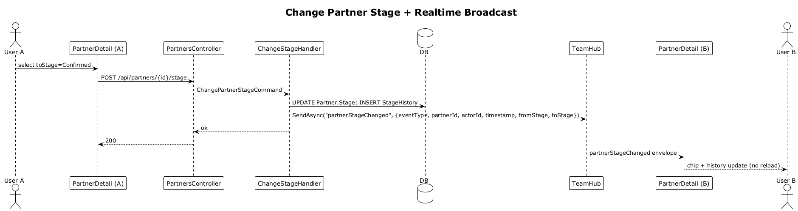

# 16 — Move Partner Through Funnel Stages

**Traces to:** L2-017 (L1-004). First slice that uses SignalR end-to-end.

## Components
- Backend `Partners/ChangeStage.cs` — `ChangePartnerStageCommand : ITeamScopedRequest { PartnerId, TargetTeamId, ToStage }`. Handler updates `Partner.Stage`, inserts `PartnerStageHistory` row, then publishes `partnerStageChanged` through `Broadcast.TeamEvent(...)` with `eventType`, `entityId`, `actorId`, `timestamp`, and `{ partnerId, fromStage, toStage }`.
- Backend `PartnersController.ChangeStage` — `POST /api/partners/{id}/stage` body `{ toStage }`.
- Backend `Realtime/TeamHub.cs` — minimal hub already specified in slice 32; this slice is its first publisher.
- Frontend `feature-partners/partner-detail-page` includes a stage switcher. Subscribes to `partnerStageChanged` via `RealtimeService` to update other clients viewing the same partner.
- Frontend partner-detail also renders the `PartnerStageHistory` chronologically (L2-017 AC2).

## Workflow

## API
| Method | Path | Body | Response |
|---|---|---|---|
| POST | `/api/partners/{id}/stage` | `{ toStage }` | `200` |

## Acceptance tests (L2-017)
- Stage changes persist and a history row is appended with from/to/by/at.
- Two team members connected: A changes stage, B's screen reflects within 2 s without reload.
- The pushed event payload includes event type, entity ID, actor ID, and timestamp.

## Radical simplicity notes
- Stage history is one append-only table; no event-sourcing framework.
- The realtime broadcast happens after the DB transaction commits — a single `await SaveChanges` then `await hub.SendAsync`.
