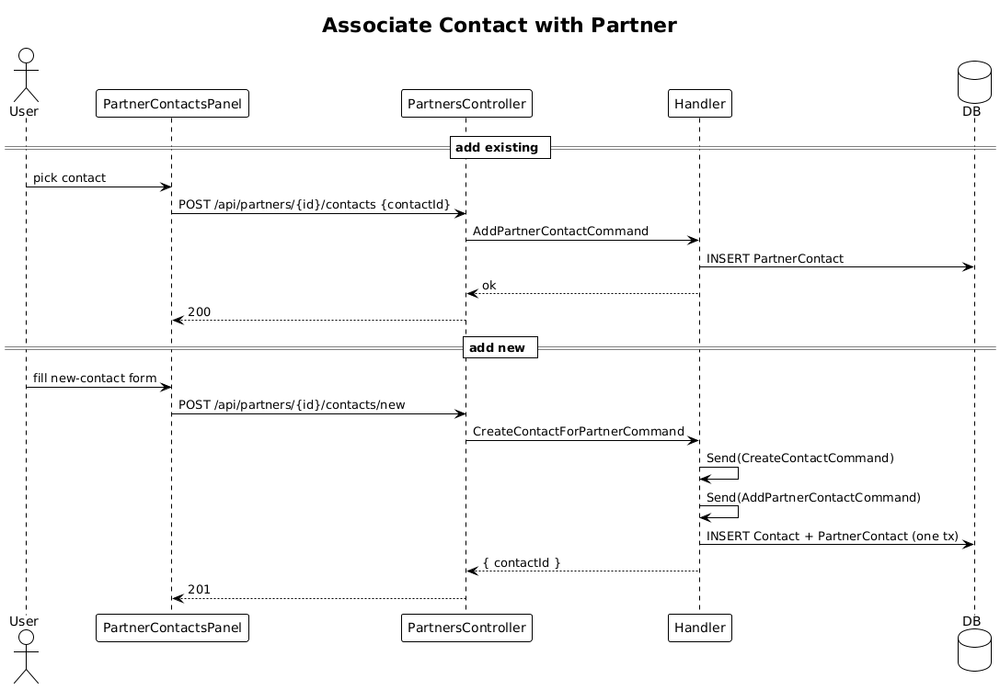

# 17 — Associate Contacts with Partner

**Traces to:** L2-018 (L1-004).

## Components
- New join `PartnerContact { PartnerId, ContactId }` (no extra columns).
- Backend `Partners/AddContactToPartner.cs` — `AddPartnerContactCommand { PartnerId, ContactId }`. Handler inserts the join row; team scope verified via `TeamScopeBehavior` against `Partner.TeamId`.
- Backend `Partners/RemoveContactFromPartner.cs` — deletes the join row, contact remains.
- Backend `Partners/CreateContactForPartner.cs` — composite command: dispatches `CreateContactCommand` (slice 08) then `AddPartnerContactCommand`. Single transaction.
- Backend `PartnersController` — `POST /api/partners/{id}/contacts`, `DELETE /api/partners/{id}/contacts/{contactId}`, `POST /api/partners/{id}/contacts/new` (creates + associates).
- Frontend `feature-partners/partner-contacts-panel` lists associated contacts with "Add existing" picker (search) and "Add new" form (slice 08 form).

## Workflow

## Acceptance tests (L2-018)
- Add existing contact; appears within 1 s.
- Add via new-contact form on partner page; one submission creates + associates.
- Remove association; contact remains in team's contact list.
- Associating a contact or partner outside the actor's team is rejected by team scope.

## Radical simplicity notes
- Composite "create + associate" reuses the slice 08 handler — no duplicated validation. The composite handler simply sends two MediatR requests inside one DB transaction.
