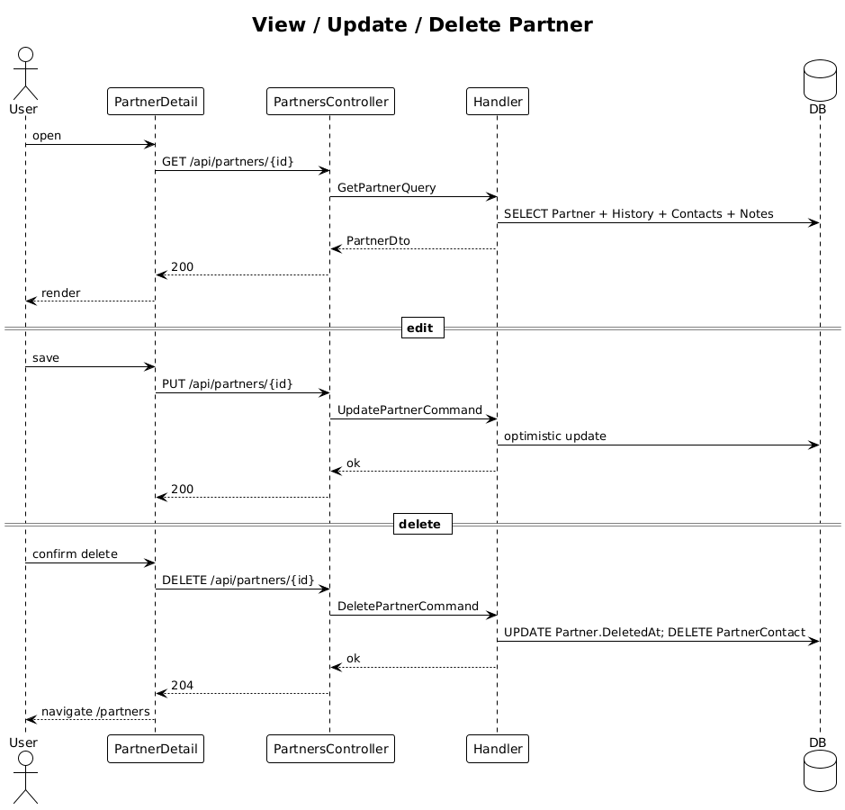

# 19 — View, Update, Delete Partner

**Traces to:** L2-020 (L1-004). Same patterns as contact CRUD slices 09-11.

## Components
- Backend `Partners/GetPartner.cs` — returns Partner with stage history, associated contacts, notes (most-recent-first).
- Backend `Partners/UpdatePartner.cs` — optimistic concurrency via `Version`.
- Backend `Partners/DeletePartner.cs` — soft delete (`DeletedAt`), detaches contacts (deletes rows from `PartnerContact` join), `[Authorize(Roles="Admin,CityLead")]`.
- Backend `PartnersController` — GET/PUT/DELETE `/api/partners/{id}`.
- Frontend `feature-partners/partner-detail-page`, `partner-form` for edit, reused confirm dialog.

## Workflow

## Acceptance tests (L2-020)
- Detail screen shows name, website, city, stage, history, contacts, notes.
- City Lead delete prompts confirm, soft-deletes, detaches contacts.
- Lower roles deleting → 403.

## Radical simplicity notes
- "Detach but not delete" associated contacts is a single parameterized EF Core `ExecuteDelete`/tracked-remove operation on `PartnerContact` rows inside the same handler — no event/saga and no concatenated SQL.
