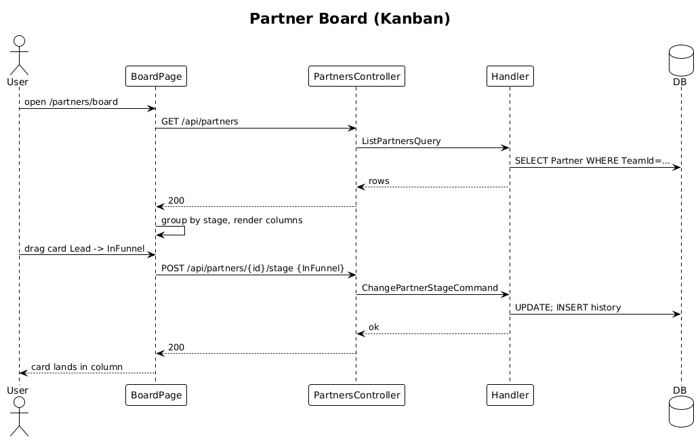

# 20 — Partner Funnel Board

**Traces to:** L2-021 (L1-004).

## Components
- Backend reuses `Partners/ListPartners.cs` (`ListPartnersQuery { TargetTeamId, Stages?: PartnerStage[], Page, Size }`). Returns rows grouped client-side.
- Backend `PartnersController.List` — `GET /api/partners?stages=Lead,InFunnel`.
- Frontend `feature-partners/partner-board-page` — three-column Kanban on `≥768px`, single-column stack with stage section headers on `<768px` (per `ui-design.pen` `Tablet / Partners` and `Mobile / Partners` patterns).
- Frontend uses Angular CDK Drag-and-Drop to drag a card across columns; `cdkDropListDropped` calls `PARTNER_SERVICE.changeStage(...)` (slice 16).

## Workflow

## Acceptance tests (L2-021)
- Filter by selected stage(s) returns only those.
- ≥768 px: three Kanban columns with per-column counts.
- <768 px: single-column stack with stage headers.

## Radical simplicity notes
- No per-stage DB query; one query returns all partners and the client groups by stage. ≤500 partners per team makes this trivial.
- Drag-to-change-stage reuses slice 16 endpoint — no new API for "move card".
