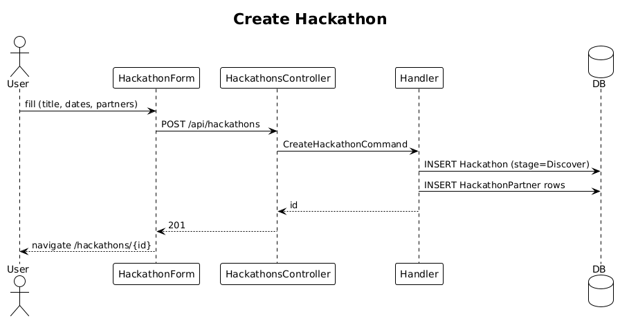

# 21 — Create Hackathon ✅ Complete

**Traces to:** L2-022 (L1-005).

## Components
- Backend `Hackathons/CreateHackathon.cs` — `CreateHackathonCommand : ITeamScopedRequest { TargetTeamId, Title, StartDate, EndDate, HostCity, PartnerIds: Guid[] }`. Defaults `Stage` to `Discover`. Inserts `Hackathon` plus rows in `HackathonPartner` join table.
- Backend `HackathonsController.Create` — `POST /api/hackathons`.
- Frontend `feature-hackathons/hackathon-form` reactive form; partner picker is multi-select chip input from `components`.

## Workflow

## Validation
- `Title`: 1–200 chars.
- `StartDate ≤ EndDate` (cross-field).
- `HostCity`: required, ≤100 chars.
- Each `PartnerId` belongs to user's team (verified in handler before insert).

## API
| Method | Path | Body | Response |
|---|---|---|---|
| POST | `/api/hackathons` | `{ title, startDate, endDate, hostCity, partnerIds }` | `201 { id }` / `400` |

## Acceptance tests (L2-022)
- New hackathon persists with default stage Discover.
- `endDate < startDate` rejected with field-level error.
- Partner associations persist.

## Radical simplicity notes
- One handler, one transaction, one composite insert.
