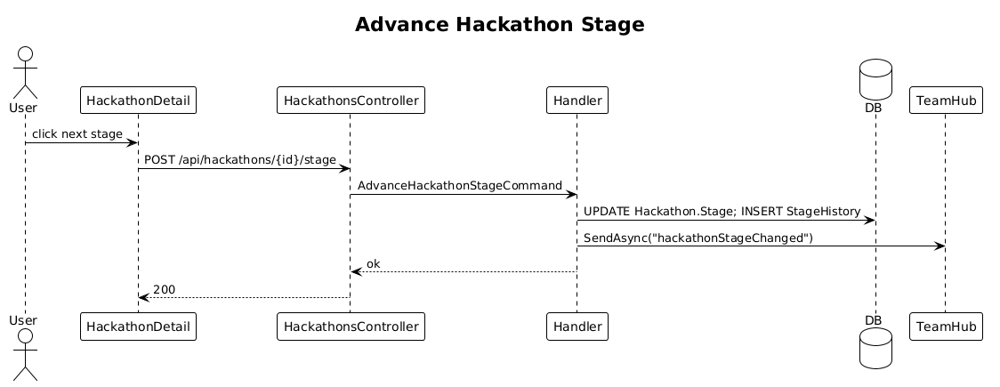

# 22 — Track 4 D's Process Stage

**Traces to:** L2-023 (L1-005).

## Components
- Backend `Hackathons/AdvanceStage.cs` — `AdvanceHackathonStageCommand : ITeamScopedRequest { HackathonId, ToStage }`. Updates stage, inserts `HackathonStageHistory`, broadcasts `hackathonStageChanged` via `TeamHub`.
- Backend `HackathonsController.AdvanceStage` — `POST /api/hackathons/{id}/stage` body `{ toStage }`. (Both advance and retreat use the same endpoint.)
- Frontend `feature-hackathons/hackathon-detail-page` renders the four D's as a horizontal step indicator with the current step highlighted; clicking a step calls the endpoint. History list below.

## Workflow

## Acceptance tests (L2-023)
- Advance/retreat persists; history entry appended.
- Other team member's screen reflects new stage within 2 s without reload.

## Radical simplicity notes
- Mirror of partner stage change (slice 16). Same `*StageHistory` pattern; same SignalR broadcast. The two stage features intentionally share zero code but follow an identical shape — copying twelve lines is cheaper than abstracting "any-staged-thing".
