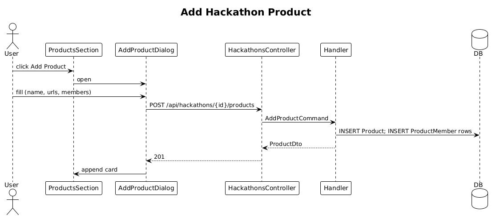

# 23 — Document Hackathon Products ✅ Accepted

**Traces to:** L2-024 (L1-005).

## Components
- New entity `Product` (in 00-architecture model) + join `ProductMember { ProductId, UserId? OR ContactId? }`. To avoid the abstraction, we use two nullable FKs and a CHECK constraint that exactly one is set.
- Backend `Hackathons/AddProduct.cs` — `AddProductCommand { HackathonId, Name, Description?, RepoUrl?, DemoUrl?, MemberUserIds: Guid[], MemberContactIds: Guid[] }`.
- Backend `Hackathons/UpdateProduct.cs`, `Hackathons/DeleteProduct.cs`.
- Backend `HackathonsController` — `POST /api/hackathons/{id}/products`, etc.
- Frontend `feature-hackathons/products-section` on the hackathon detail screen: card per product showing name, links, member chips. `add-product-dialog` for create/edit.

## Workflow

## Validation
- `Name`: required.
- `RepoUrl`/`DemoUrl`: optional; absolute http/https URI.

## Acceptance tests (L2-024)
- Add product with at least name → persists, displayed within 1 s.
- Malformed URL rejected.
- Members (existing users or contacts) assigned and shown on card.

## Radical simplicity notes
- The two-nullable-FK design avoids polymorphic abstractions. The CHECK constraint catches inconsistent inserts at the database boundary; the handler doesn't have to.
