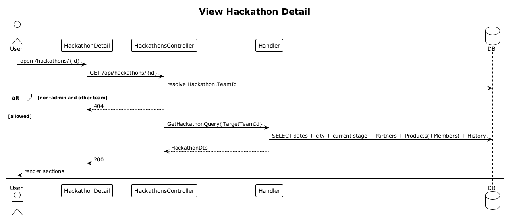

# 24 — View Hackathon Details

**Traces to:** L2-025 (L1-005).

## Components
- Backend `Hackathons/GetHackathon.cs` — `GetHackathonQuery : ITeamScopedRequest { Id, TargetTeamId }` returning title, dates, host city, associated partners, current 4 D's stage, stage history, and products with members. The controller resolves the hackathon's `TeamId` before dispatch; non-Administrators requesting another team's hackathon receive 404.
- Backend `HackathonsController.Get` — `GET /api/hackathons/{id}`.
- Frontend `feature-hackathons/hackathon-detail-page` — sections in order: products, partners, stage history. On `<576px` collapses to a single-column stack with collapsible sections (per L2-025 AC2).

## Workflow

## Responsive
- `<576px`: collapsible accordions for products / partners / history.
- `≥576px`: simple sections one below the other.

## Acceptance tests (L2-025)
- Renders all listed details, products before partners before history.
- `<576px` shows accordion sections.
- Non-Administrator requesting another team's hackathon receives 404.

## Radical simplicity notes
- One query with multiple `.Include(...)`s; no GraphQL, no per-section endpoint.
