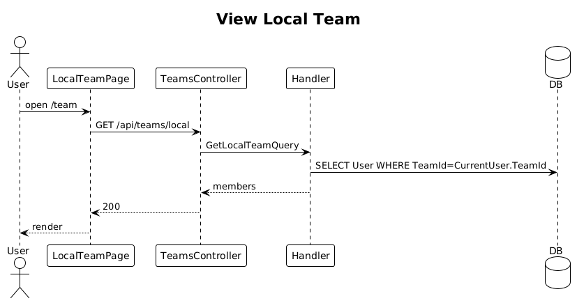

# 25 — View Local Team

**Traces to:** L2-026 (L1-006).

## Components
- Backend `Teams/GetLocalTeam.cs` — returns members of `CurrentUser.TeamId`: name, role(s), email, active status. Query orders by role priority, then last name.
- Backend `TeamsController.Local` — `GET /api/teams/local`.
- Frontend `feature-team/local-team-page` — table on ≥576 px (matches `ui-design.pen` `Desktop / Team`), card list on <576 px.

## Workflow

## Responsive
- `<576px`: vertical card list (per L2-026 AC2).

## Acceptance tests (L2-026)
- Members shown with all four columns, sorted by role then last name.

## Radical simplicity notes
- One query — no separate endpoint per role view.
