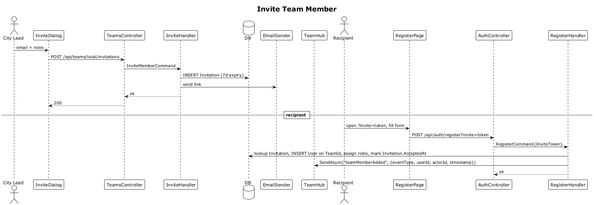

# 26 — Invite Team Member

**Traces to:** L2-027 (L1-006).

## Components
- New entity `Invitation { Id, Email, TeamId, RoleNames: string[] (csv), Token, CreatedById, ExpiresAt, AcceptedAt? }`.
- Backend `Teams/InviteMember.cs` — `InviteMemberCommand : ITeamScopedRequest { TargetTeamId, Email, Roles }`. `[Authorize(Roles="Admin,CityLead")]`. Inserts `Invitation`, sends email with link `/auth/register?invite={token}`.
- Backend `Teams/AcceptInvite.cs` — runs after `RegisterCommand` (slice 02): if a `?invite=` param is present, the registration handler joins the user to that team, assigns the roles, and publishes `teamMemberAdded` with the standard realtime envelope.
- Backend `TeamsController.Invite` — `POST /api/teams/local/invitations`.
- Frontend `feature-team/invite-dialog` — email + role multi-select.

## Workflow

## API
| Method | Path | Body | Response |
|---|---|---|---|
| POST | `/api/teams/local/invitations` | `{ email, roles[] }` | `200` |

## Acceptance tests (L2-027)
- City Lead invites; recipient receives email with 7-day link; completing registration places them on the inviter's team with the chosen roles.
- Lower roles attempting to invite → 403.
- Accepting the invite publishes `teamMemberAdded` with event type, entity ID, actor ID, and timestamp.

## Radical simplicity notes
- The "register from invite" flow is **the same registration handler** with one extra optional input. No parallel "claim invitation" endpoint.
