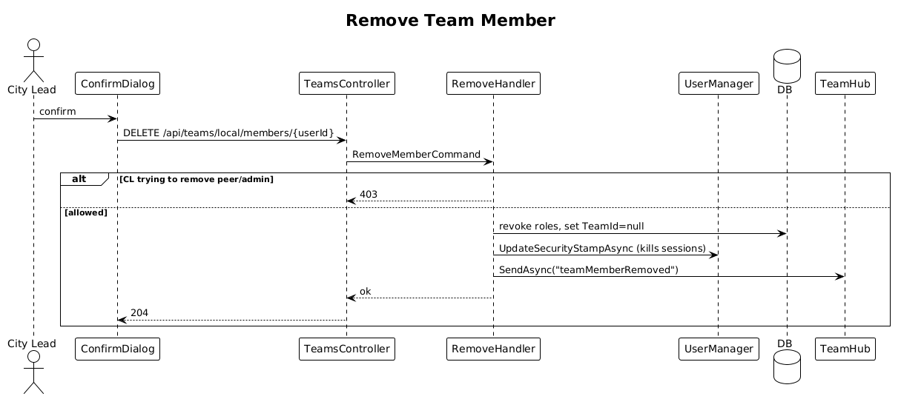

# 27 — Remove Team Member

**Traces to:** L2-028 (L1-006).

## Components
- Backend `Teams/RemoveMember.cs` — `RemoveMemberCommand : ITeamScopedRequest { TargetTeamId, UserId }`. Revokes all roles on that team for that user, sets `User.IsActive=false` (or detaches `TeamId` to nullable; see Open Questions), bumps security stamp via `UserManager.UpdateSecurityStampAsync` to terminate active sessions, and broadcasts `teamMemberRemoved` via `TeamHub`.
- Backend `TeamsController.Remove` — `DELETE /api/teams/local/members/{userId}`. `[Authorize(Roles="Admin,CityLead")]` plus per-handler check: City Lead may not remove another City Lead or Admin.
- Frontend confirm dialog from `components`.

## Workflow

## Acceptance tests (L2-028)
- City Lead removes lower-role member; their session ends; other team members see realtime update.
- City Lead removing another City Lead or Admin → 403.

## Radical simplicity notes
- "End active session" is `UpdateSecurityStampAsync` — Identity invalidates cookies on next request automatically.

## Open Questions
- Should a removed user be deleted, deactivated, or detached from the team? Default: keep the user row (audit), set `TeamId` to null and revoke roles. They can be re-invited.
