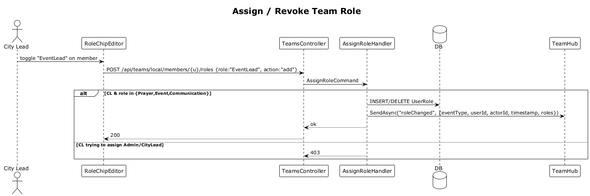

# 28 — Assign / Revoke Team Role ✅ Accepted

**Traces to:** L2-029 (L1-006). Reuses `AssignRoleCommand` from slice 07.

## Components
- Backend `Auth/AssignRole.cs` already exists from slice 07. This slice just adds the per-team enforcement: when the actor is a CityLead, the target user must be on the actor's team, and the role must be one of the three lower roles.
- Backend `TeamsController.AssignRole` — `POST /api/teams/local/members/{userId}/roles` body `{ role, action: "add"|"remove" }`. Forwards to `AssignRoleCommand`, then publishes `roleChanged` with the standard realtime envelope.
- Frontend `feature-team/role-chip-editor` — a chip-input on each row of `local-team-page` allowing toggle of the three roles. Disabled chips for roles the current user can't assign.

## Workflow

## Acceptance tests (L2-029)
- City Lead toggles a Prayer/Event/Communication Lead role on a member; persists; broadcast via SignalR.
- City Lead tries to toggle CityLead/Admin → 403.
- Effect on next request without sign-out (Identity reloads roles per request).
- The pushed event payload includes event type, entity ID, actor ID, and timestamp.

## Radical simplicity notes
- The role-toggle endpoint is one route; behavior depends on the role string in the body.
- No separate "promote" / "demote" endpoints.
