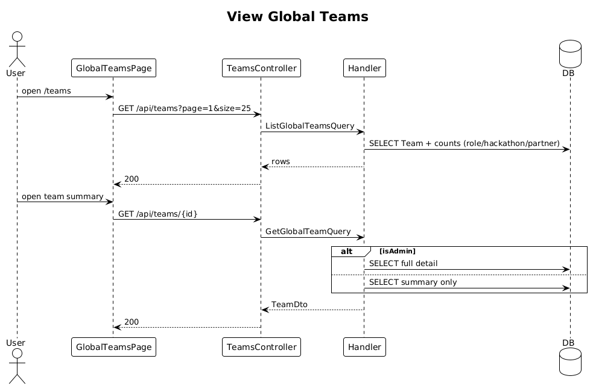

# 29 — View & Search Global Teams ✅ Complete

**Traces to:** L2-030, L2-031 (L1-006, L1-011).

## Components
- Backend `Teams/ListGlobalTeams.cs` — `ListGlobalTeamsQuery { Page, Size, Search? }`. Returns only public summary fields for non-Administrators: city, role counts, active hackathon count, and partner count. Paginated 25/page. This is the public-summary behavior required by L2-008 AC3.
- Backend `Teams/GetGlobalTeam.cs` — `GetGlobalTeamQuery { Id }`. For non-Admin, returns only public summary fields. For Admin, returns full detail (delegates to internal "view as team" path that enables cross-team).
- Backend `TeamsController` — `GET /api/teams?search=` and `GET /api/teams/{id}`.
- Frontend `feature-team/global-teams-page` — list view (matches `Desktop / Team`-style table on wide, cards on narrow). Search input debounced, ≥2 chars; shorter terms do not fire a request.

## Workflow

## API
| Method | Path | Response |
|---|---|---|
| GET | `/api/teams?page=1&size=25&search=ottawa` | `200 { rows, total }` |
| GET | `/api/teams/{id}` | `200 TeamDto` (public-fields-only for non-Admin) |

## Acceptance tests
- L2-030 AC1: every team paginated 25/page with summary fields.
- L2-030 AC2: non-Admin opening another team sees public fields only.
- L2-030 AC3: Admin sees full team detail.
- L2-031 AC1: search by city or member name returns matches in ≤500 ms.
- L2-031 AC2: search terms shorter than 2 characters do not execute a request.
- L2-008 AC3: non-Admin list/detail responses never include contacts, partner notes, contact notes, or other private records.

## Radical simplicity notes
- The "public summary" vs "full detail" branch is one `if` in `GetGlobalTeamQuery` choosing which DTO to populate. No separate "PublicTeamDto" controller route.
