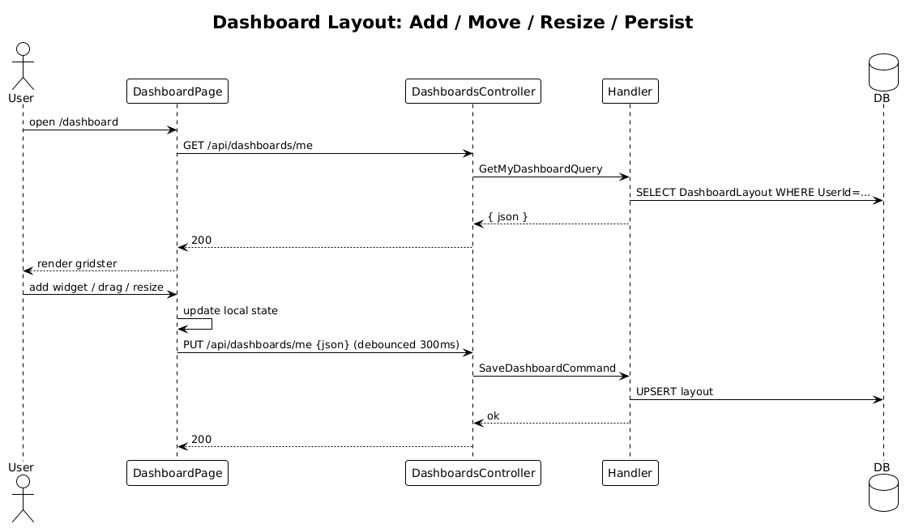

# 30 — Dashboard: Default Layout, Add/Move/Resize/Remove Widgets, Persistence

**Traces to:** L2-032, L2-033, L2-035 (L1-007). Bundles three closely related ACs that share the same data and the same gridster integration.

## Components
- New entity `DashboardLayout { UserId (PK), Json: string, UpdatedAt }`. The JSON is the literal gridster v2 layout config (`{ items: [{ id, x, y, cols, rows, type, config }] }`).
- Backend `Dashboards/GetMyDashboard.cs` — returns layout for `CurrentUser.Id`, or empty if absent.
- Backend `Dashboards/SaveMyDashboard.cs` — `SaveDashboardCommand { Json }` validates that the payload parses as JSON, is ≤16 KB, and has an `items` array, then upserts the row. Last-write-wins (L2-035 AC2).
- Backend `DashboardsController` — `GET /api/dashboards/me`, `PUT /api/dashboards/me`.
- Frontend `feature-dashboard/dashboard-page` — renders `<gridster>` from `angular-gridster2`. Drop-zone empty state shown when `items.length === 0` with an "Add widget" CTA (per `ui-design.pen` empty state).
- Frontend `feature-dashboard/widget-catalog-dialog` — list of available widget types (initially: `kpi`, `line-chart`).
- Frontend persists by calling `DASHBOARD_SERVICE.save(json)` debounced 300 ms after any drop/resize/remove.

## Workflow

## API
| Method | Path | Body | Response |
|---|---|---|---|
| GET | `/api/dashboards/me` | – | `200 { json }` |
| PUT | `/api/dashboards/me` | `{ json }` | `200` |

## Acceptance tests
- L2-032 AC1: new user sees empty dashboard + "Add widget" CTA.
- L2-032 AC2 / L2-035 AC1: layout restored exactly across sign-out/sign-in and across devices.
- L2-033: add / drag / resize / remove all persist within budget.
- L2-035 AC2: concurrent edits last-write-wins; no error.

## Radical simplicity notes
- The layout is opaque JSON in one column. The backend doesn't model widgets; only the frontend understands them. New widget types ship with no schema migration.
- Last-write-wins is just `INSERT ... ON CONFLICT (UserId) DO UPDATE`. No version field, no merge.
- `INSERT ... ON CONFLICT` describes the EF Core upsert intent; implementation uses provider-supported EF APIs or parameterized SQL only.
