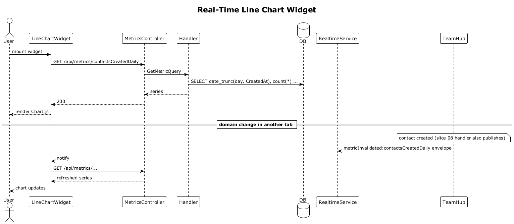

# 31 — Real-Time Metric Charts (line-chart widget)

**Traces to:** L2-034 (L1-007, L1-008).

## Components
- Backend `Metrics/GetMetric.cs` — `GetMetricQuery : ITeamScopedRequest { TargetTeamId, Metric, FromUtc, ToUtc, Bucket }`. Switch on `Metric` returns precomputed series:
  - `contactsCreatedDaily`
  - `partnerStageTransitionsWeekly`
  - `hackathonStageProgress`
- Backend `MetricsController` — `GET /api/metrics/{metric}?from=…&to=…&bucket=day`.
- Backend on every domain mutation that affects metrics, the producing handler also publishes a SignalR event `metricInvalidated:{metric}` using the standard realtime envelope. The frontend re-fetches the affected metric.
- Frontend `feature-dashboard/widgets/line-chart-widget` — Chart.js v4 line chart. On init, calls `METRIC_SERVICE.get(...)`. Subscribes to `RealtimeService.on('metricInvalidated:{metric}', refetch)` to refresh on push.
- Frontend chart palette uses dark-monochromatic tokens (per L2-042 AC3).

## Workflow

## Responsive (L2-034 AC3)
- `<576px`: legend wraps below; tap shows tooltip.

## Acceptance tests
- Widget renders with current data within 1 s of widget mount.
- Underlying domain change → chart updates within 2 s without page reload (driven by SignalR push + refetch).
- `<576px`: axes remain labeled, legend wraps, and tapping a point shows the value tooltip.

## Radical simplicity notes
- "Real-time chart" is implemented as **invalidate + refetch**, not as streaming chart points. This avoids client-side timeline merging logic and keeps the metric query the single source of truth.
- Metrics are computed by SQL aggregates at query time (no precomputed metric table) until volume forces caching.
