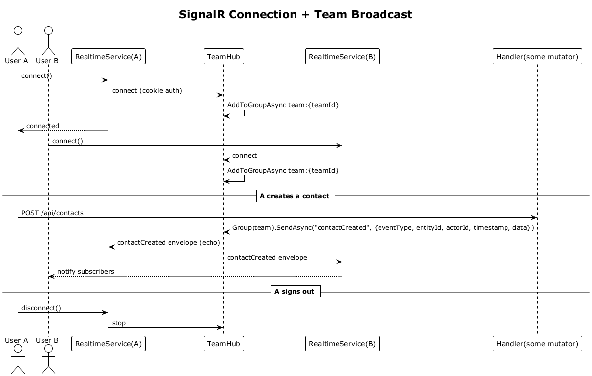

# 32 — SignalR Connection Lifecycle & Push Events ✅ Accepted

**Traces to:** L2-036, L2-037, L2-048 (L1-008, L1-013).

## Components
- Backend `Realtime/TeamHub.cs` — `[Authorize]` SignalR Hub at `/hubs/team`. `OnConnectedAsync`: read `CurrentUser.TeamId`, `Groups.AddToGroupAsync(connectionId, $"team:{teamId}")`. No methods invoked from clients — server is publish-only.
- Backend `Realtime/Broadcast.cs` — small helper that always emits the required envelope:
  ```csharp
  await hub.Clients.Group($"team:{teamId}").SendAsync(eventName, new TeamEvent {
      EventType = eventName,
      EntityId = entityId,
      ActorId = currentUser.Id,
      Timestamp = clock.UtcNow,
      Data = payload
  });
  ```
  Called from the handlers that need to publish (slices 08, 16, 22, 27, 28, 33).
- Frontend `api/realtime.service.ts` — wraps `@microsoft/signalr.HubConnectionBuilder` with an `IRetryPolicy` that starts at 1 second, doubles up to 60 seconds, then keeps retrying every 60 seconds indefinitely. Exposes `on(event, handler)` returning an unsubscribe and `connect()` / `disconnect()`.
- Frontend `app-shell` calls `realtime.connect()` on app init when authenticated, `realtime.disconnect()` on sign-out.

## Events catalog (initial)

| Event | Payload | Producer slice |
|---|---|---|
| `contactCreated` | envelope `{ eventType, entityId: contactId, actorId, timestamp, data: { contactId } }` | 08 |
| `partnerStageChanged` | envelope `{ eventType, entityId: partnerId, actorId, timestamp, data: { partnerId, fromStage, toStage } }` | 16 |
| `hackathonStageChanged` | envelope `{ eventType, entityId: hackathonId, actorId, timestamp, data: { hackathonId, fromStage, toStage } }` | 22 |
| `noteAdded` | envelope `{ eventType, entityId: noteId, actorId, timestamp, data: { targetType, targetId, noteId } }` | 12, 18 |
| `teamMemberAdded` / `teamMemberRemoved` | envelope `{ eventType, entityId: userId, actorId, timestamp, data: { userId } }` | 26, 27 |
| `roleChanged` | envelope `{ eventType, entityId: userId, actorId, timestamp, data: { userId, roles[] } }` | 28 |
| `metricInvalidated:{metric}` | envelope `{ eventType, entityId: teamId, actorId, timestamp, data: { metric } }` | every mutator that affects metrics |

## Workflow


## Acceptance tests
- L2-036 AC1: connection established within 2 s of bootstrap; user joined `team:{teamId}` group.
- L2-036 AC2: connection drop triggers reconnect with exponential backoff up to 60 s, indefinitely.
- L2-036 AC3: sign-out disconnects and cancels reconnect attempts.
- L2-037 AC1: events delivered to other team members within 2 s.
- L2-037 AC2: open partner-detail screen reflects matching event within 500 ms.
- L2-037 payload contract: every pushed team event includes event type, entity ID, actor ID, and timestamp.
- L2-048: a SignalR latency test publishes 100 events between two connected clients and asserts p95 ≤2 s and p99 ≤5 s.

## Radical simplicity notes
- One hub, one group naming convention (`team:{id}`), one publish helper. No back-end pub/sub; the Hub itself is the bus.
- Clients are publish targets only — they never invoke hub methods. This eliminates a whole class of authorization concerns on the hub.
- The envelope is centralized in `Broadcast.cs` so producer handlers cannot accidentally omit actor or timestamp fields.
