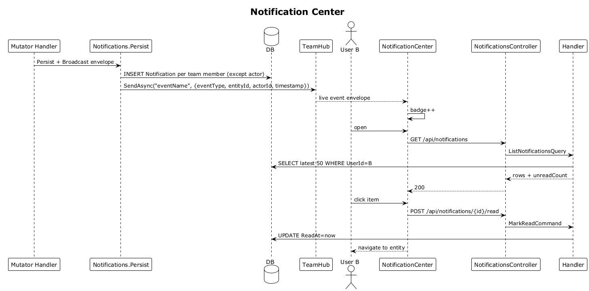

# 33 — Notification Center ✅ Accepted

**Traces to:** L2-037 (persistence aspect), L2-038 (L1-008).

## Components
- New entity `Notification` (already in 00-architecture domain): per-user row, with `Kind`, `EntityType/Id`, `ActorId`, `CreatedAt`, `ReadAt?`.
- Backend `Notifications/Persist.cs` — single helper called by every realtime publisher (slices 08, 12, 16, 18, 22, 26, 27, 28). For each recipient on the team (excluding the actor), insert a `Notification` row using the same event envelope fields (`eventType`, `entityId`, `actorId`, `timestamp`). The realtime broadcast also continues to fire.
- Backend `Notifications/List.cs` — `ListNotificationsQuery`. Returns latest 50, unread-first.
- Backend `Notifications/MarkRead.cs` — `MarkReadCommand { NotificationId? — null = mark-all }`.
- Backend `NotificationsController` — `GET /api/notifications`, `POST /api/notifications/{id}/read`, `POST /api/notifications/read-all`.
- Frontend `feature-notifications/notification-center` — slide-over panel matching `ui-design.pen` `Desktop / Notifications`. Bell icon shows unread badge.
- Frontend bell unread count is fetched on app bootstrap and updated live by subscribing to all notification-producing realtime events (just bumps the count and prepends).

## Workflow

## API
| Method | Path | Response |
|---|---|---|
| GET | `/api/notifications` | `200 { rows, unreadCount }` |
| POST | `/api/notifications/{id}/read` | `204` |
| POST | `/api/notifications/read-all` | `204` |

## Acceptance tests (L2-038)
- Offline user sees notifications upon next sign-in.
- Unread items appear top with badge; total badge always visible.
- Click marks-read, decrements badge, navigates to entity screen.
- Mark-all-read clears badges within 500 ms.

## Radical simplicity notes
- Persistence is a fan-out insert (one row per team member). For typical team sizes (≤20) this is trivial. If teams grow, switch to a "delivered up to N" pointer per user.
- The realtime + notification persistence share the same trigger point — one helper call from each producing handler does both.
