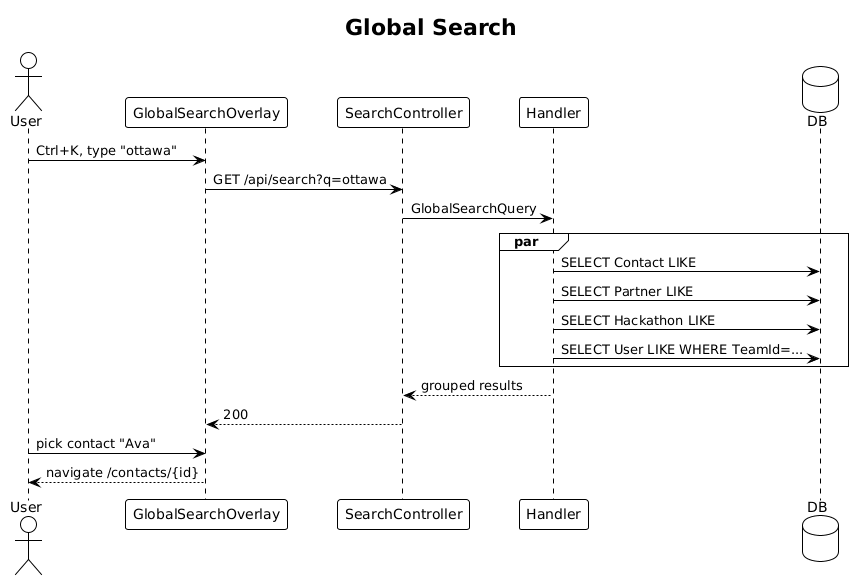

# 34 — Global Search ✅ Complete

**Traces to:** L2-043 (L1-011).

## Components
- Backend `Search/GlobalSearch.cs` — `GlobalSearchQuery : ITeamScopedRequest { TargetTeamId, Term }`. Runs four parallel DB queries (`Contact`, `Partner`, `Hackathon`, `User` within team) using the same indexes from slice 13. Returns grouped result `{ contacts, partners, hackathons, members }`, max 10 per group.
- Backend `SearchController` — `GET /api/search?q=ottawa`.
- Frontend `feature-search/global-search-overlay` — opens via `Ctrl/Cmd+K` or the topbar search input. On `<576px` takes the full screen (per L2-043 AC3); on wider viewports renders as a centered modal.
- Frontend selecting a result navigates via `Router.navigate(['/contacts', id])` etc.

## Workflow

## API
| Method | Path | Response |
|---|---|---|
| GET | `/api/search?q=...` | `200 { contacts, partners, hackathons, members }` |

## Acceptance tests (L2-043)
- ≥2 chars triggers search; ≤500 ms over 10 k records per type.
- Selecting a result navigates to its detail screen.
- `<576px` overlay is full-screen.

## Radical simplicity notes
- Four small parallel SQL queries (one per entity), `Task.WhenAll`. No unified search index, no Elasticsearch, no separate search service.
- The four queries reuse the same indexes already added by slice 13 plus simple indexes on `Partner.Name` / `Hackathon.Title` / `User.DisplayName`.
